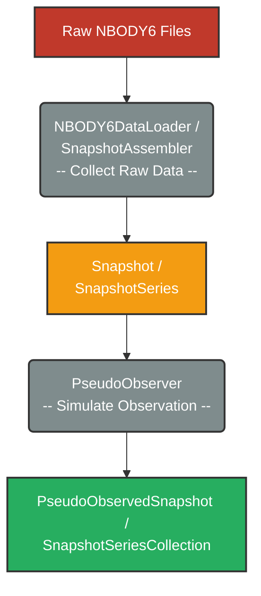

# NBODY6 Data Analysis

This project provides a pipeline that transforms raw NBODY6 outputs into analysis-ready "pseudo-observed" data by parsing files, assembling time-series snapshots, and simulating observational constraints.

The core workflow follows the diagram below:



## Requirements

Python 3.12+ with the following packages (see [`requirements.txt`](./requirements.txt) for pinned versions):

- `astropy`
- `pandas`
- `numpy`
- `matplotlib`
- `pyarrow`
- `pot`
- `joblib`
- `python-dotenv`
- `tqdm`
- `jupyter`

## Usage

### Configure Environment

Create a `.env` from the [`.env.template`](.env.template) and set the required variables:

- `SIM_ROOT_BASE` (path to raw NBODY6 output)
- `OUTPUT_BASE` (where pipeline outputs are written)
- `MPL_STYLE` (optional: matplotlib style for plots)

```bash
# Edit .env and set the variables listed above
cp .env.template .env
```

### Collect NBODY6 Simulation Runs

- Parse and assemble raw NBODY6 outputs (build `SnapshotSeries`, cache results with `joblib`, and export overall/annular statistics):

  ```sh
  python ./src/collect_simulation_stats.py [--slim|--full] [--log-file PATH]
  ```

  **Options:**
  - `--slim` (default): Store only snapshot headers in cache to reduce storage.
  - `--full`: Store complete raw snapshots including all star data.
  - `--log-file PATH`: Specify custom log file path. Defaults to `OUTPUT_BASE/log/batch_collect_simulation.log`.

- Compute inclination statistics (produces per-snapshot inclination summaries):

  ```sh
  python ./src/collect_inclination_stats.py [--log-file PATH]
  ```
  
  **Options:**
  - `--log-file PATH`: Specify custom log file path. Defaults to `OUTPUT_BASE/log/batch_collect_inclination.log`.

Notes:

- Both scripts read raw data from `SIM_ROOT_BASE` and write outputs under `OUTPUT_BASE` (see `.env`).
- Core counts and parallelism can be adjusted in the scripts.
- Check `OUTPUT_BASE/log/` for progress when debugging (if not using `--log-file`).

### Outputs

The pipeline writes results under `OUTPUT_BASE` using the following structure (examples shown):

- `cache/raw/` — cached raw `SnapshotSeries` joblib files named `<sim-label>-raw.joblib`.
- `cache/obs/` — cached pseudo-observed `SnapshotSeriesCollection` joblib files named `<sim-label>-obs.joblib`.
- `stats/overall_stats/` — per-simulation overall statistics CSVs: `<sim-label>-overall_stats.csv`.
- `stats/annular_stats/` — per-simulation annular statistics CSVs: `<sim-label>-annular_stats.csv`.
- `stats/inclination_stats/` — inclination summaries: `<sim-label>-inclination_stats.csv`.
- `log/` — script log files such as `batch.log` and per-run logs.
- `figures/` — optional plots and figures produced by notebooks or scripts.

Use these caches to skip expensive parsing/assembly steps when rebuilding datasets or running analysis.

### Notebooks for Analysis

- See the [`notebooks/`](./notebooks/) directory for Jupyter notebooks used for dataset preparation and visualization (for example, `dataset_split.ipynb`, `annular_stats.ipynb`, `overall_stat.ipynb`).

### _Quick Checklist_

- Create and edit `.env` from `.env.template` with `SIM_ROOT_BASE` and `OUTPUT_BASE`.
- Run `python ./src/collect_simulation_stats.py` to parse and cache simulations.
- Run `python ./src/collect_inclination_stats.py` to compute inclination summaries.
- Inspect `OUTPUT_BASE/cache/` and `OUTPUT_BASE/stats/*_stats/` for results and logs.

## Data Processing Pipeline Overview

The data processing pipeline consists of two main stages:

- **Collect Raw Data.** Parsing and assembling raw NBODY6 output files into structured [`Snapshot`](./src/nbody6/data/snapshot.py) objects representing the cluster state at each timestamp.
- **Simulate Observations.** Transforming `Snapshot` objects into [`PseudoObservedSnapshot`](./src/nbody6/data/snapshot.py) objects by applying observational constraints such as magnitude limits and resolution limits.

### Data Model

The collected NBODY6 data are structured into `Snapshot` and [`SnapshotSeries`](./src/nbody6/data/series.py) classes.

Each `Snapshot` represents the cluster state at a single timestamp `time`, and contains two primary `pandas.DataFrame` objects and a dictionary of header metadata:

|     Component      | Description                                                                               | _Essential_ Columns                                                                                                     |
| :----------------: | ----------------------------------------------------------------------------------------- | ----------------------------------------------------------------------------------------------------------------------- |
|     **stars**      | Position, velocity, and stellar attributes for all stars (singles and binary components). | `name`, `x`, `y`, `z`, `vx`, `vy`, `vz`, `mass`, `log_R_R_sol` (`rad`), `log_L_L_sol` (`zlum`), `log_T_eff_K` (`tempe`) |
| **binary_systems** | Pairing and orbital attributes for all binaries (regularized and unregularized).          | `pair`, `obj1_ids`, `obj2_ids`, `ecc`, `log_period_days` (`p`), `semi` $[\mathrm{AU}]$                                  |
|     **header**     | Snapshot metadata including cluster properties and summary statistics.                    | `time`, `r_tidal`, `r_half_mass`, `total_mass`, etc.                                                                    |

Notice that in `PseudoObservedSnapshot`, the `stars` DataFrame may contain merged photocentric objects representing unresolved binaries.

**Key Metrics** (Calculated in physical units: pc, km/s, $\mathrm{M}_{\odot}$, Myr):

|           Metric           | Formula or Definition                                                                                                                |
| :------------------------: | ------------------------------------------------------------------------------------------------------------------------------------ |
|      **`dist_dc_pc`**      | Distance to density center $d_{\mathrm{dc,pc}} = \sqrt{(x - x_{\mathrm{dc}})^2 + (y - y_{\mathrm{dc}})^2 + (z - z_{\mathrm{dc}})^2}$ |
|     **`r_half_mass`**      | Half-mass radius enclosing 50% of total mass **within $2r_{\mathrm{tidal}}$**                                                        |
|   **`dist_dc_r_tidal`**    | Normalized distance: `dist_dc_pc / r_tidal`                                                                                          |
| **`dist_dc_r_half_mass`**  | Normalized distance: `dist_dc_pc / r_half_mass`                                                                                      |
|  **`is_within_r_tidal`**   | Boolean: `dist_dc_pc` $\leqslant$ `r_tidal`                                                                                          |
| **`is_within_2x_r_tidal`** | Boolean: `dist_dc_pc` $\leqslant$ $2\times$ `r_tidal`                                                                                |

Two related “within tidal radius” flags are provided: `is_within_r_tidal` (within `r_tidal`) and `is_within_2x_r_tidal` (within $2r_{\mathrm{tidal}}$).

\*_All radial quantities and tidal radii are measured relative to the density center recalculation provided in <u>densCentre.txt</u>, which serves as the primary inertial reference._

Binary systems are classified as follows:

|            Type            | Criteria                                                                                  |
| :------------------------: | ----------------------------------------------------------------------------------------- |
|    **`is_wide_binary`**    | $a>1\,000\,\mathrm{AU}$                                                                   |
|    **`is_hard_binary`**    | $a < \frac{r_{\mathrm{hm}}}{N_{\mathrm{star}}}$ (Heggie’s criterion)                      |
|   **`is_multi_system`**    | System involves more than 2 individual stars (len(`obj1_ids`) > 1 OR len(`obj2_ids`) > 1) |
|  **`is_within_r_tidal`**   | Boolean: **ALL** component stars satisfy `is_within_r_tidal`.                             |
| **`is_within_2x_r_tidal`** | Boolean: **ALL** component stars satisfy `is_within_2x_r_tidal`.                          |

A `SnapshotSeries` is a temporal sequence of `Snapshot` objects that stores the complete simulation, while [`SnapshotSeriesCollection`](./src/nbody6/data/collection.py) holds multiple `SnapshotSeries` (for example, the same run pseudo-observed at different positions).

### Input NBODY6 Files

The following table lists the essential files produced by NBODY6 and processed by this project.
Each file contains data at multiple timestamps, `time` (in Myr):

|     File Name      | Description                                                                                                                                                                                    | Key Columns                                                                                                                                                                                                  | Essential Header                                                                                                              |
| :----------------: | ---------------------------------------------------------------------------------------------------------------------------------------------------------------------------------------------- | ------------------------------------------------------------------------------------------------------------------------------------------------------------------------------------------------------------ | ----------------------------------------------------------------------------------------------------------------------------- |
|     **OUT34**      | Position and velocity of ALL single stars, unregularized binaries, and the centers of mass of regularized binaries (`cmName`).                                                                 | `name`, `x`, `y`, `z` $[\mathrm{pc}]$, `vx`, `vy`, `vz` $[\mathrm{km\,s}^{-1}]$                                                                                                                              | `time`, galactic position (`rg` $\cdot$ `rbar` $[\mathrm{pc}]$), bulk velocity (`vg` $\cdot$ `vstar` $[\mathrm{km\,s}^{-1}]$) |
|    **fort.83**     | Stellar properties for **single stars** and **unregularized binaries**. This includes mass, radius, bolometric luminosity, and effective temperature.                                          | `name`, `mass` $[\mathrm{M}_{\odot}]$, `rad` $[\log_{10}(\mathrm{R}_{\odot})]$, `zlum` $[\log_{10}(\mathrm{L}_{\odot})]$, `tempe` $[\log_{10}(\mathrm{K})]$                                                  | `time`                                                                                                                        |
|    **fort.19**     | Pairing information for **unregularized binaries**. Binary components (`name1` / `name2`) may reference regularized binary centers (`cmName`).                                                 | `name1`, `name2`, `ecc`, `p` $\log_{10}([\mathrm{day}])$                                                                                                                                                     | `time`                                                                                                                        |
|    **fort.82**     | Stellar properties for both components of **regularized binaries**.                                                                                                                            | `name1`, `name2`, `mass1`, `mass2` $[\mathrm{M}_{\odot}]$, `rad1`, `rad2` $[\log_{10}(\mathrm{R}_{\odot})]$, `zlum1`, `zlum2` $[\log_{10}(\mathrm{L}_{\odot})]$, `tempe1` `tempe2` $[\log_{10}(\mathrm{K})]$ | `time`                                                                                                                        |
|      **OUT9**      | Pairing information and orbital attributes of **regularized binaries**. Each row links two component stars (`name1`, `name2`) to their common center of mass (`cmName`).                       | `cmName`, `name1`, `name2`, `ecc`, `p` $\log_{10}([\mathrm{day}])$                                                                                                                                           | `time`                                                                                                                        |
| **densCentre.txt** | Recalculated cluster density center and tidal radius from density profile analysis. Used as the primary reference for all distance calculations. This is NOT a standard output of NBODY6 code. | `time`, `r_tidal` $[\mathrm{pc}]$, `density_center_x`, `density_center_y`, `density_center_z` $[\mathrm{pc}]$                                                                                                | — (data serves as header)                                                                                                     |

These files are parsed by specialized [`FileParser`](./src/nbody6/parser/) classes, coordinated by [`NBODY6DataLoader`](./src/nbody6/loader.py).  
The parsed data is then assembled by the [`SnapshotAssembler`](./src/nbody6/assembler.py) into `Snapshot` objects.

The assembly process involves:

- **Position/Velocity Merging**:
  <u>OUT34</u> and <u>OUT9</u> data are combined to expand regularized binary centers of mass into individual component positions.

- **Attribute Integration**:
  Stellar properties from <u>fort.82</u> and <u>fort.83</u> are merged with the positional data.

- **Distance Calculations**:
  All distance-based metrics are computed relative to the density center from <u>densCentre.txt</u>.

- **Binary Pairing**:
  Binary pairings from both <u>OUT9</u> (regularized) and <u>fort.19</u> (unregularized) are integrated into a unified catalog.

### Simulate Observations

To mimic observational constraints (such as magnitude and resolution limits), a `Snapshot` is transformed into a [`PseudoObservedSnapshot`](./src/nbody6/observer.py) using the [`PseudoObserver`](./src/nbody6/observer.py).

This process includes:

#### Pre-filtering

Filter `stars` and `binary_systems` based on the `is_within_2x_r_tidal` flag to focus only on cluster members and their immediate surroundings.

#### Hierarchical Unresolved Binary System Merging
Binary systems that fall below the resolution limit are merged into single photocentric objects.
The pipeline handles hierarchical systems (e.g., triples or quadruples) recursively:
innermost binaries are merged first, and the resulting "pseudo-stars" are then merged with outer components until the entire unresolved system is represented by a single entry.

**Illustrative outcomes:**

- **Two individual stars**:
  Merged into a single photocentric object.
  $\Rightarrow$ `n_binary_system` remains 1; `n_star` drops from 2 to 1.

- **Unresolved binary pair plus one resolved star**:
  The binary pair is merged first, then combined with the other component if it's also unresolved.
  $\Rightarrow$ Results in a single entry representing 3 stars.

- **Multiple unresolved binaries**:
  Each binary is merged using the two-object formulas, then the results are recursively merged.
  $\Rightarrow$ `n_binary_system` remains 3; `n_star` drops from 4 to 1.

Given the properties of two objects (1 and 2), the merged properties are calculated as:

- **Position & Velocity**:
  $\mathbf{r}_{\mathrm{photo}} = \frac{L_1\mathbf{r}_1 + L_2 \mathbf{r}_2}{L_1 + L_2},\;\mathbf{v}_{\mathrm{photo}} = \frac{L_1 \mathbf{v}_1 + L_2 \mathbf{v}_2}{L_1 + L_2}$
- **Total Luminosity**: $L_{\mathrm{tot}} = L_1 + L_2$
- **Total Mass**: $M_{\mathrm{tot}} = M_1 + M_2$
- **Equivalent Radius**: $R_{\mathrm{eq}} = \sqrt{R_1^2 + R_2^2}$
- **Effective Temperature** (Stefan-Boltzmann law):
  $T_{\mathrm{eff}} = \left(\frac{L_{\mathrm{tot}}}{4\pi R_{\mathrm{eq}}^2 \sigma_{\mathrm{SB}}}\right)^{1/4}$

*Note: For hierarchical systems, these formulas are applied recursively at each merging step based on the luminosity-weighted centers.*

## Statistics and Visualization

After generating pseudo-observed snapshots, statistical analyses and visualizations are performed to compare cluster-level statistics across different initial conditions.

NBODY6 simulations output snapshots at adaptive timestamps that vary between runs. For example:

- **Run A** may produce snapshots at: 0, 1.0, 2.0, 3.0, ... Myr
- **Run B** may produce snapshots at: 0, 0.8, 1.6, 2.4, ... Myr

To compare between runs, metric time series (e.g., `r_tidal`, `binary_fraction`) are aligned onto a uniform 1 Myr grid (within the covered time range) to avoid over-interpolation artifacts. This alignment is performed during analysis in the notebooks (for example, [`notebooks/annular_stats.ipynb`](./notebooks/annular_stats.ipynb)).
Once aligned, metrics from different `init_pos` runs are aggregated and visualized.

## :construction: Future Work

Extend `PseudoObserver` with a synthetic photometry step so pseudo-observed snapshots can be filtered and compared in a survey-like way (for example, Gaia-like selections). Conceptually, this involves:

1. Assign a spectral energy distribution (SED) that describes flux as a function of wavelength for each star, based on its stellar parameters (e.g., effective temperature, luminosity, metallicity);
2. Integrate the SED through instrument passbands (e.g., Gaia G/BP/RP) to obtain absolute magnitudes and colors;
3. Convert to apparent photometry by applying distance modulus and extinction;
4. Apply a selection model (magnitude limits and completeness), optionally adding simple photometric noise and basic blending heuristics.

Practical tools to support the under-implemented pieces include [`synphot`](https://synphot.readthedocs.io/) for synthetic photometry and bandpass-based flux integration, plus [`speclite`](https://speclite.readthedocs.io/) and [`sedpy`](https://sedpy.readthedocs.io/) for filter and transmission-curve utilities.
