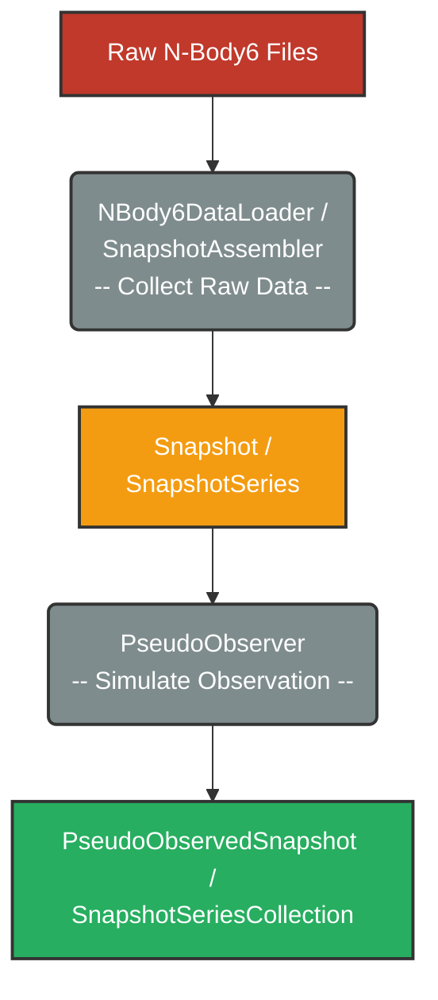

# N-Body6 Data Analysis

## Data Processing Pipeline Overview

The pipeline that transforms raw N-Body6 outputs into analysis-ready "observed" data by parsing files,
assembling them into time-series snapshots, and simulating observational constraints.

The core workflow follows the diagram below:

### N-Body6 Files

The following table lists the essential files produced by N-Body6 and processed by this project.
Each file contains data at multiple timestamps `time` in Myr:

| File Name          | Description                                                                                                                                                                            | _Essential_ Columns                                                                                                                                                                                            | _Essential_ Header                                                                  |
|--------------------|----------------------------------------------------------------------------------------------------------------------------------------------------------------------------------------|----------------------------------------------------------------------------------------------------------------------------------------------------------------------------------------------------------------|-------------------------------------------------------------------------------------|
| **OUT34**          | Position and velocity of ALL single stars, unregularized binaries and the centers of mass of regularized binaries (`cmName`).                                                          | `name`, `x`, `y`, `z` [$\mathrm{pc}$], `vx`, `vy`, `vz` [$\mathrm{km\,s}^{-1}$]                                                                                                                                | `time`, galactic position (`rg`$\times$`rbar`), bulk velocity (`vg`$\times$`vstar`) |
| **OUT9**           | Pairing information and orbital attributes of **regularized binaries**. Each row links two component stars (`name1`, `name2`) to their common center of mass (`cmName`).               | `cmName`, `name1`, `name2`, `ecc`, `p` $\log_{10}([\mathrm{day}])$                                                                                                                                             | `time`                                                                              |
| **fort.82**        | Stellar properties for both components of **regularized binaries**.                                                                                                                    | `name1`, `name2`, `mass1`, `mass2` [$\mathrm{M}_{\odot}$], `rad1`, `rad2` [$\log_{10}(\mathrm{R}_{\odot})$], `zlum1`, `zlum2` [$\log_{10}(\mathrm{L}_{\odot})$], `tempe1` `tempe2` [$\log_{10}({\mathrm{K}})$] | `time`                                                                              |
| **fort.83**        | Stellar properties for **single stars** and **unregularized binaries**.                                                                                                                | `name`, `mass` [$\mathrm{M}_{\odot}$], `rad` [$\log_{10}(\mathrm{R}_{\odot})$], `zlum` [$\log_{10}(\mathrm{L}_{\odot})$], `tempe` [$\log_{10}({\mathrm{K}})$]                                                  | `time`                                                                              |
| **fort.19**        | Pairing information for **unregularized binaries**. Binary components (`name1` / `name2`) may reference regularized binary centers (`cmName`).                                         | `name1`, `name2`, `ecc`, `p` $\log_{10}([\mathrm{day}])$                                                                                                                                                       | `time`                                                                              |
| **densCentre.txt** | Recalculated cluster density center and tidal radius from density profile analysis. Used as the primary reference for all distance calculations. NOT a vanilla output of N-Body6 code. | `time`, `r_tidal` [$\mathrm{pc}$], `density_center_x`, `density_center_y`, `density_center_z` [$\mathrm{pc}$]                                                                                                  | — (data serves as header)                                                           |

These files are parsed by specialized `FileParser` classes, coordinated by the `NBody6DataLoader`.  
The parsed data is then assembled by the `SnapshotAssembler` into `Snapshot` objects.

The assembly process involves:

- **Position/Velocity Merging**:
  <u>OUT34</u> and <u>OUT9</u> data are combined to
  expand regularized binary centers of mass into individual component positions

- **Attribute Integration**:
  Stellar properties from <u>fort.82</u> and <u>fort.83</u> are merged with positional data

- **Distance Calculations**:
  All distance-based metrics are computed relative to the density center from <u>densCentre.txt</u>

- **Binary Pairing**:
  Binary pairings from both <u>OUT9</u> (regularized) and <u>fort.19</u> (unregularized)
  are integrated into one unified catalog

### Collect Raw Data

The collected N-Body6 data is structured into `Snapshot` and `SnapshotSeries` classes

Each `Snapshot` represents the cluster state at a single timestamp `time`
and contains two primary `pandas.DataFrame` objects and a dictionary of header metadata:

| Component          | Description                                                                              | _Essential_ Columns                                                                                                 |
|--------------------|------------------------------------------------------------------------------------------|---------------------------------------------------------------------------------------------------------------------|
| **stars**          | Position, velocity and stellar attributes for all stars (singles and binary components). | `name`, `x`, `y`, `z`, `vx`, `vy`, `vz`, `mass`, `log_R_R_sol` (`rad`), `log_L_L_sol` (`zlum`), `log_T_K` (`tempe`) |
| **binary_systems** | Pairing and orbital attributes for all binaries (regularized and unregularized).         | `pair`, `obj1_ids`, `obj2_ids`, `ecc`, `log_period_days` (`p`), `semi` [$\mathrm{AU}$]                              |
| **header**         | Snapshot metadata including cluster properties and summary statistics.                   | `time`, `r_tidal`, `r_half_mass`, `total_mass`, etc.                                                                |

**Key Metrics** include:

| Metric                       | Formula or Definition                                                                                   |
|------------------------------|---------------------------------------------------------------------------------------------------------|
| **`dist_dc_pc`**             | Distance to density center $d_{\text{dc,pc}} = \sqrt{(x - x_{dc})^2 + (y - y_{dc})^2 + (z - z_{dc})^2}$ |
| **`r_half_mass`**            | Half-mass radius enclosing 50% of total mass **within $2r_{\text{tidal}}$**                             |
| **`dist_dc_r_tidal`**        | Normalized distance: `dist_dc_pc / r_tidal`                                                             |
| **`dist_dc_r_half_mass`**    | Normalized distance: `dist_dc_pc / r_half_mass`                                                         |
| **`is_within_(2x_)r_tidal`** | Boolean: `dist_dc_pc` $\leqslant$ ($2\times$) `r_tidal`                                                 |

*_All radial quantities are measured relative to the density center from <u>densCentre.txt</u>._

Binary systems are classified as follows:

| Type                         | Criteria                                                                                  |
|------------------------------|-------------------------------------------------------------------------------------------|
| **`is_wide_binary`**         | $a>1\,000\,\mathrm{AU}$                                                                   |
| **`is_hard_binary`**         | $a<{r_\mathrm{hm}}/{N_\mathrm{star}}$ (Heggie’s criterion)                                |
| **`is_multi_system`**        | System involves more than 2 individual stars (len(`obj1_ids`) > 1 OR len(`obj2_ids`) > 1) |
| **`is_within_(2x_)r_tidal`** | Boolean: **ALL** component stars satisfy `is_within_(2x_)r_tidal`.                        |

A `SnapshotSeries` is a temporal sequence of `Snapshot` objects that stores the complete simulation.

### Simulate Observations

To mimic observational constraints
(e.g., magnitude limits, resolution limits),
the `Snapshot` object can be transformed into a `PseudoObservedSnapshot` object by `PseudoObserver`.

This process includes:

#### Preparation

Filtering `stars` and `binary_systems` based on `is_within_2x_r_tidal` flag
and update stellar `is_binary` flags accordingly.

#### Hierarchical Unresolved Binary System Merging

Unresolved binaries most often comprise two stars.
However, hierarchical systems, where components are themselves unresolved binaries, can also arise.
These cases are resolved recursively:
innermost binaries are merged first, and the process continues outward until all levels are combined.

Illustrative cases:

- **Two individual stars**:
  Merged into a single photocentric object.
  $\Rightarrow$ `n_binary_system` remains 1; `n_star` drops from 2 to 1.

- **Unresolved binary pair plus single star**:
  The binary pair is merged first, then combined with the single star.
  $\Rightarrow$ `n_binary_system` remains 2; `n_star` drops from 3 to 1.

- **Multiple unresolved binaries**:
  Each binary is merged using the two-object formulas, then the results are recursively merged.
  $\Rightarrow$ `n_binary_system` remains 3; `n_star` drops from 4 to 1.

Given the properties of two objects (1 and 2), the merged properties are calculated as:

- **Position & Velocity**:
  $\mathbf{r}_{\mathrm{photo}} = \frac{L_1\mathbf{r}_1 + L_2 \mathbf{r}_2}{L_1 + L_2},\;\mathbf{v}_{\mathrm{photo}} = \frac{L_1 \mathbf{v}_1 + L_2 \mathbf{v}_2}{L_1 + L_2}$
- **Total Luminosity**: $L_{\mathrm{tot}} = L_1 + L_2$
- **Total Mass**: $M_{\mathrm{tot}} = M_1 + M_2$
- **Equivalent Radius**: $R_{\mathrm{eq}} = \sqrt{R_1^2 + R_2^2}$
- **Effective Temperature** (Stefan-Boltzmann law):
  $T_{\mathrm{eff}} = \left(\frac{L_{\mathrm{tot}}}{4\pi R_{\mathrm{eq}}^2 \sigma_{\mathrm{SB}}}\right)^{1/4}$

For hierarchical systems, these formulas are applied recursively at each merging step.

#### :construction: [TODO] Magnitude Cuts

~~Stars fainter than a specified absolute magnitude threshold (e.g., $M_g > 18$) are excluded.~~

## Statistics and Visualization

After generating pseudo-observed snapshots, statistical analyses and visualizations are performed
to compare some cluster characteristic statistics across different initial conditions.

N-Body6 simulations output snapshots at adaptive timesteps that vary between runs. For example:

- **Run A** may produce snapshots at: 0, 1.0, 2.0, 3.0, ... Myr
- **Run B** may produce snapshots at: 0, 0.8, 1.6, 2.4, ... Myr

To compare between runs, the time series of metrics (e.g., `r_tidal`, `binary_fraction`)
are temporally aligned to a uniform 1 Myr grid within its range to avoid over-interpolation artifacts.
Once aligned, metrics from different `init_pos` runs are aggregated and visualized.
